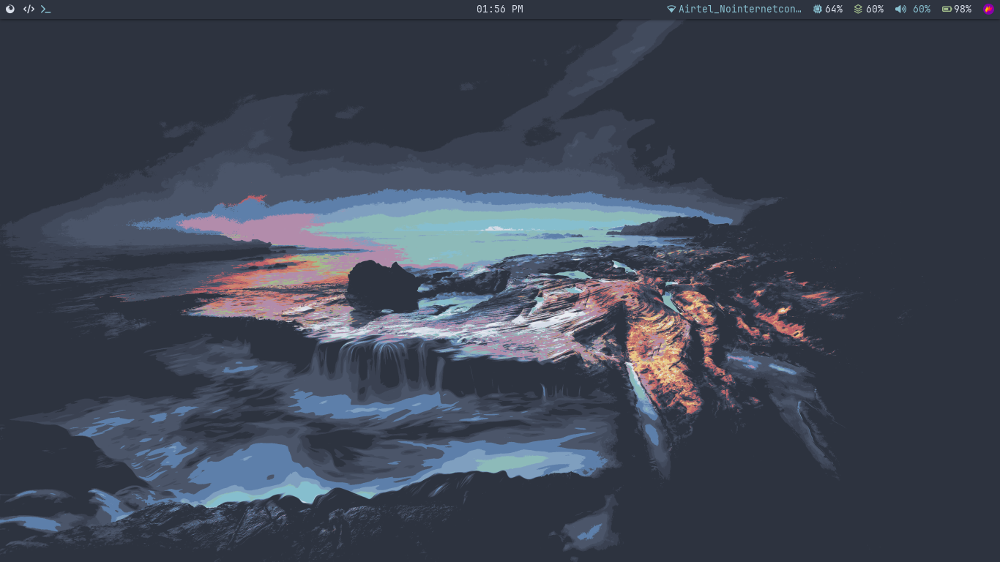
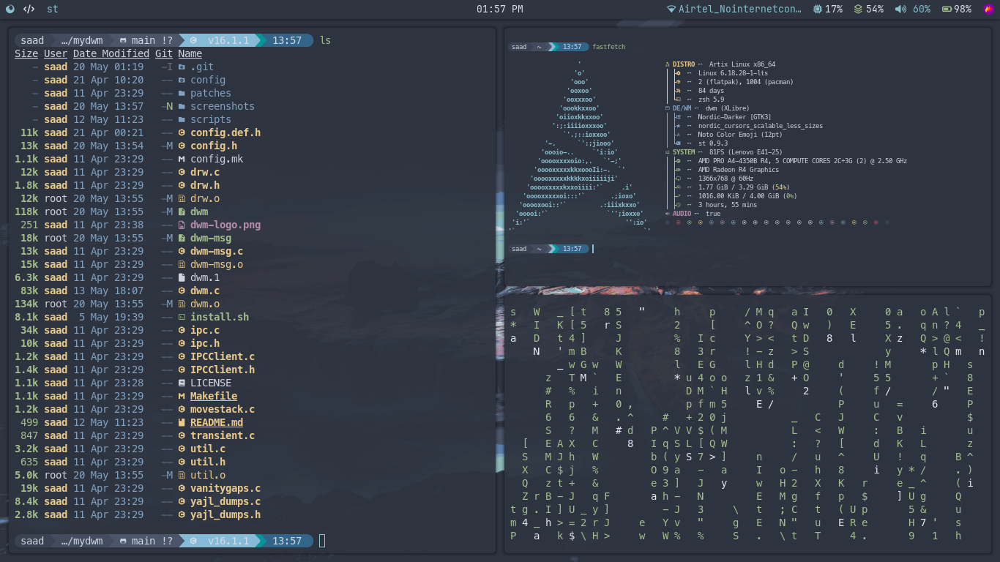
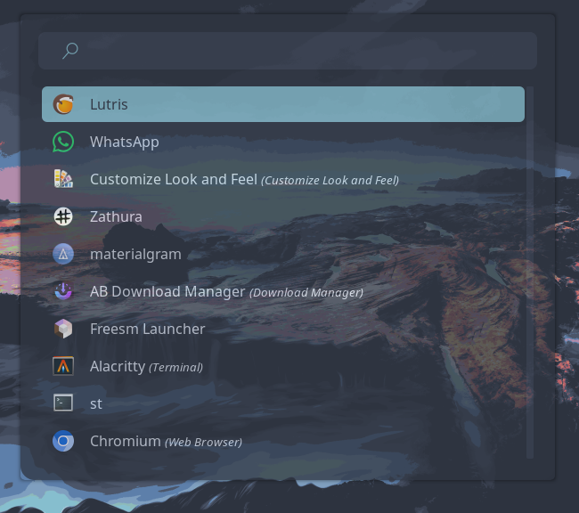

# mydwm

dwm with patches for a better experience.

## Patches
- vanitygaps
- pertag
- movestack
- attachbelow
- actualfullscreen
- swallow
- noborder
- focusonclick
- warp
- autostart
- restartsig
- scratchpad
- cyclelayouts
- savefloats
- statusallmons
- ewmhtags
- systray
- ipc

## Screenshots
- dwm

- Tiling

- Polybar

- Rofi


## Dependencies
- libx11
- libxft
- libxinerama
- yajl
- jq
- xorg-xprop
- picom
- dunst
- feh
- flameshot
- polybar

## Install
You can use install script with:
```bash
cd mydwm
chmod +x install.sh
./install.sh
```

## ⌨️ Keybindings

Press <kbd>SUPER</kbd> + <kbd>/</kbd> inside of dwm for an **interactive keybind viewer**.

### Daily Keybinds

| Keybind | Action |
|---------|--------|
| <kbd>SUPER</kbd> + <kbd>x</kbd> | Open terminal |
| <kbd>SUPER</kbd> + <kbd>r</kbd> | Launch rofi (app launcher) |
| <kbd>SUPER</kbd> + <kbd>q</kbd> | Close window |
| <kbd>SUPER</kbd> + <kbd>Left</kbd> / <kbd>Right</kbd> | Focus next / previous window |
| <kbd>SUPER</kbd> + <kbd>h</kbd> / <kbd>l</kbd> | Resize master area |
| <kbd>SUPER</kbd> + <kbd>1-9</kbd> | Switch to tag (workspace) |
| <kbd>SUPER</kbd> + <kbd>Shift</kbd> + <kbd>1-9</kbd> | Move window to tag |
| <kbd>SUPER</kbd> + <kbd>t</kbd> | Tile layout |
| <kbd>SUPER</kbd> + <kbd>f</kbd> | Fullscreen |
| <kbd>SUPER</kbd> + <kbd>Shift</kbd> + <kbd>Space</kbd> | Toggle floating |
| <kbd>SUPER</kbd> + <kbd>Shift</kbd> + <kbd>e</kbd> | Quit dwm |
| <kbd>SUPER</kbd> + <kbd>Ctrl</kbd> + <kbd>q</kbd> | Power menu |
